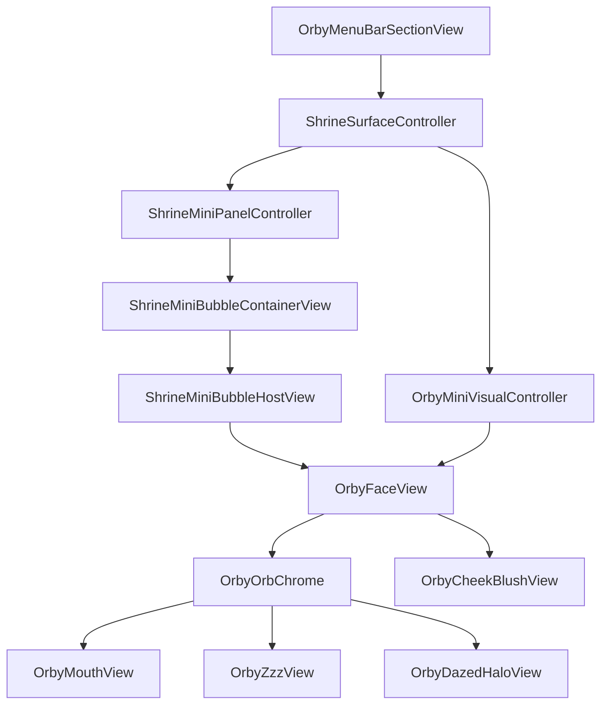

# Orby — macOS Mini Shrine Face (full specification)

| | |
|--|--|
| **Status** | Shipped baseline + spec-aligned polish · **[feature freeze](Orby_FEATURE_FREEZE.md)** (flying sphere) |
| **Platform** | macOS only (`Apps/NoxMac`) |
| **Parent** | [SHRINE_MACOS_SURFACE_SPEC.md](../../SHRINE_MACOS_SURFACE_SPEC.md), [SHRINE_ARCHITECTURE.md](../../SHRINE_ARCHITECTURE.md) |

## 1. Purpose

Orby is the living circular face/orb of the macOS Mini Shrine Bubble.

Orby is part of Nox Shrine. Shrine is the surface/module/presence layer. Orby is the face.

Orby should feel like a small living ambient orb: quiet, expressive, polished, reactive, and slightly creature-like. It must not feel like a chatbot, messenger bubble, dashboard, app launcher icon, sticker, emoji, or debug prototype.

Orby expresses Nox’s local state visually. It does not think independently, does not speak as a separate assistant, and does not own memory.

**Core rule:** Shrine is the body. Orby is the face.

## 2. Naming

Use **Orby** for the visible living orb/face layer (`OrbyFaceView`, `OrbyOrbChrome`, `OrbyMiniVisualController`, `OrbyMoodResolver`, `OrbyMouthView`, `OrbyZzzView`, `OrbyDazedHaloView`, …).

Use **Shrine** for surface/module architecture (`ShrineSurfaceController`, `ShrineMiniPanelController`, Full Shrine, placement store, menu entry).

Do not rename all Shrine architecture to Orby. Legacy `ShrineMini*` typealiases may remain temporarily; new face-layer code prefers `Orby*`.

## 3. Product Role

Orby should: be always-on-top when shown; stay circular; track cursor with eyes; subtle head turn; hover react (circle-gated); sleep after cursor idle; wake ritual; drag with elastic visual deformation + face lag (panel moves immediately); post-drag dazed after throw-like release; click → Full Shrine; context menu; non-Dock.

Orby must not: chat assistant UI; large text; dashboard; moralize; sound by default; AI/LLM visuals; camera/screen recording; persist cursor/animation state; new invasive permissions.

## 4. Platform and Parent Surface

macOS only. Menu bar **ORBY** section:

- **One elevated plate button** — full row is clickable (label “Toggle Orby” + **32 pt** mood-matched orb preview). Plate has hover highlight + press feedback (`OrbyMenuBarSectionView`).
- **Toggle** shows Orby at **default bottom-right** (same as Reset Position on the orb). **Hide** keeps last dragged origin per display for the next manual reposition.
- Orb context menu (right-click on bubble): Open Full Shrine, Hide Orby, Reset Position, mute/unmute sounds. **Click** on orb (no drag) opens Full Shrine.

## 5. Panel / Window Behavior

Transparent floating `NSPanel`: non-Dock, always-on-top, no rectangular chrome/shadow/focus ring/titlebar. Visible silhouette = circular orb. Panel may be larger than orb for Zzz/halo/shadow padding; padding does not count for hover excited.

## 6. Shape and Visual Identity

Circle/orb only — no squircle, no app-icon tile, no gray box. Soft depth: gradient, highlight, rim, circular shadow. Face above orb layers.

## 7. Adaptive Bezel

Bezel adapts to **effective** background brightness when available safely (system/panel appearance proxy — **no** screen recording or screenshots).

- Light: standard rim, highlight, shadow.
- Dark: stronger rim (+20–40%), highlight (+15–25%), outer separation (+15–30%); no harsh glow or focus ring.
- Unknown: robust dual-mode default.

## 8. Hit Testing

Circle-gated: hover excited, click, drag start, context menu. `distance(cursor, orbCenter) <= orbRadius + tolerance` (~76 pt diameter, 38 pt radius, ~3 pt tolerance). Padding, Zzz, dazed halo, and squash/stretch bleed do not count for hit testing (bleed is visual only; see `OrbyOrbGeometry.visualBleedPadding`).

## 9. Position and Placement

Default bottom-right per display; clamped; persisted per display on drag end only. Not in Nox memory/timeline.

## 10. State Layers

1. **Base mood** — `OrbyMood` + `OrbyMoodResolver` (longer-lived).  
2. **Temporary expression** — `OrbyMiniVisualPhase` (hover, drag, sleep, wake, …).  
3. **Intensity** — `OrbyEmotionIntensity` (subtle · normal · strong · extreme).

Rendered via `OrbyEmotionCompositor` → `OrbyEmotionAppearance` (eyes, mouth, tint, bezel, particles).

**Spec index (topic → canonical doc):**

| Topic | Doc |
|-------|-----|
| Emotion matrix / moods | [Orby_EMOTION_MATRIX.md](Orby_EMOTION_MATRIX.md) |
| Blink, mouth, Zzz, wake mouth settle | [Orby_VISUAL_POLISH.md](Orby_VISUAL_POLISH.md) |
| Cheek blush | [Orby_CHEEK_BLUSH.md](Orby_CHEEK_BLUSH.md) |
| Launch greeting | [Orby_LAUNCH_GREETING.md](Orby_LAUNCH_GREETING.md) |
| Drag deformation | [Orby_DRAG_PHYSICS.md](Orby_DRAG_PHYSICS.md) |
| Post-drag dazed | [Orby_DRAG_DAZED.md](Orby_DRAG_DAZED.md) |
| Idle microbehaviors | [Orby_IDLE_MICROBEHAVIOR.md](Orby_IDLE_MICROBEHAVIOR.md) |
| Ambient sky (meteors) | [Orby_AMBIENT_SKY.md](Orby_AMBIENT_SKY.md) |
| Feature freeze | [Orby_FEATURE_FREEZE.md](Orby_FEATURE_FREEZE.md) |

This file (`Orby.md`) is the **integration overview**; detail lives in the linked specs. If two docs disagree, prefer the topic-specific doc above and update `Orby.md` summary to match.

### 10.1 Resolved Mood

Deterministic from existing local Nox signals only — no LLM.

### 10.2 Visual Override

Local temporary UI (`OrbyMiniVisualController`). Never persisted.

## 11. Visual Phase Priority

1. dragging  
2. context menu / direct interaction  
3. postDragDazed  
4. **launchGreeting** (manual show; silent “Hello” — see [Orby_LAUNCH_GREETING.md](Orby_LAUNCH_GREETING.md))  
5. hoverExcited (circle only)  
6. waking sequence  
7. sleepyTransition  
8. asleep  
9. awake + resolved mood  

## 12. Cursor Tracking

~60 Hz while visible; immediate eye follow (minimal smoothing); meaningful movement ≥1.5 px resets sleep timer; gaze hold ~2 s after stop then ease to center; both eyes move together; max offset ~3–6 pt.

**Sleep interrupt:** If the cursor moves meaningfully while Orby is in `sleepyTransition` (not yet `asleep`), the transition **stops immediately** and Orby returns to `awake` / `hoverExcited` — no yawn or full wake sequence. Full wake ritual applies only when waking from `asleep` (or late sleepy cancel via interaction rules in controller).

## 13. Pseudo-3D Head Turn

Subtle `rotation3DEffect` (~±6° Y, ~±4° X). Active when awake/hover; weakens in sleepy transition; off when asleep/waking/dragging. Zzz and dazed halo do not inherit transforms.

## 14. Mouth System

One persistent morphing mouth (`OrbyMouthView` + `OrbyMouthShape` + `OrbyMouthParameters`): a single filled “plasticine” blob — no stroke overlay, no second layer, no opacity swap between shapes. `openness` morphs bar → oval; `cornerLift` bends the same path for smile/frown. **No SwiftUI `.animation` on mouth parameters** (prevents width “blink” from gaze/drag transactions). Phase changes use controller **mouth settle** (~0.45 s); smile targets use smile-aware interpolation so corner lift/curvature arrive before full width. Wake yawn / sleepy / dazed stay progress-driven in compositor. Fixed 30×18 pt layout envelope with taller internal drawing area for vertical yawn.

## 14b. Eyes, blink, Zzz, dizzy

No visible eyelid overlays — blink/sleep/squint narrow eye height (`OrbyEyeView`). Ambient blink uses mood intervals × `ambientBlinkIntervalRarityMultiplier` (**1.0**, no extra rarity stretch) × per-mood `blinkIntervalScale`. **Canonical awake eye row:** spacing **16**, width **9.5**; **neutral** heights **9.5 / 7.5**; **curious** **10.5 / 8.5**; **passive** **8.5 / 6.8**; **muted** **8.0 / 6.5** — expression varies height only (not spacing or horizontal shift). Table: [Orby_VISUAL_POLISH.md](Orby_VISUAL_POLISH.md). Global `OrbyEyeMetrics.sizeScale` **1.08**. Zzz color adapts to sampled background: saturated violet on light backgrounds, pale lavender on dark backgrounds. Post-drag dazed: 4 yellow cartoon stars on an orbit **centered on the orb** (+10% star size and horizontal orbit width vs first pass). Details: [Orby_VISUAL_POLISH.md](Orby_VISUAL_POLISH.md).

## 14c. Cheek blush

Friendly-state **11×5 pt** rose capsules on an **eye-row overlay** — vertically **centered** in the 6 pt channel between eyes and mouth; **0.44** opacity, **2.5 pt** mark blur, **0.24/0.28 s** strength fade. Suppressed during drag, sleep, wake, dazed. Full constants, layout math, and QA: [Orby_CHEEK_BLUSH.md](Orby_CHEEK_BLUSH.md).

## 15. Phases (shipped)

| Phase | Behavior |
|-------|----------|
| `awake` | Resolved mood + ambient blink + [idle microbehaviors](Orby_IDLE_MICROBEHAVIOR.md) |
| `launchGreeting` | ~5.4 s greeting on manual show: 2.0 s smile hold, then silent “Hello” (he → llo mouth, **Hello** particles hold 2 s); no audio; blink off; see [Orby_LAUNCH_GREETING.md](Orby_LAUNCH_GREETING.md) |
| `hoverExcited` | Circle-gated; **surprised round “o” mouth** + cheek blush; bigger eyes (11/10); micro timer **paused** |
| `dragging` | Panel immediate; [visual deformation](Orby_DRAG_PHYSICS.md); surprised-safe mouth; micro timer **paused** |
| `postDragDazed` | ~3.5 s dizzy stars only if [throw-like classifier](Orby_DRAG_DAZED.md) fired; eyes **9×6** + sleep-like closed mouth (**0.68** opacity, no breathing); micro timer **paused**; on exit, ~0.45 s mouth settle **slit → mood** |
| `sleepyTransition` | ~6 s eyes narrow; mouth eases toward sleep slit; micro **paused** |
| `asleep` | Thin slits + animated outward Zzz stream; micro **paused** |
| `waking*` | Full ritual from `asleep` only: yawn (~4.6 s) → 2 blinks → squint → glance R/L → awake (**no** post-yawn smile phase); **0.16 s gap** between steps; micro **paused** |
| Context menu | Blocks scheduling while open |

Sleep: 30 s cursor idle → `sleepyTransition` → `asleep`. Wake from `asleep` only (not from aborted sleepy). **Notch:** same sleep/wake timer and Zzz ritual when docked (`OrbySurfaceFormBehavior.allowsSleepCycle`).

## 15b. Fake Dynamic Notch (docked Orby)

When `surfaceForm == .notch` (fake notch dock on built-in MacBook):

| Feature | Notch | Bubble |
|---------|-------|--------|
| Sleep / wake / Zzz | ✅ same | ✅ |
| Idle microbehaviors | ✅ same | ✅ |
| Ambient blink | ✅ same | ✅ |
| Launch Hello | ❌ | ✅ on manual show |
| Ambient sky meteors | ❌ (CPU) | ✅ |
| Animated starfield body | ❌ simplified gradient | ✅ full |
| Bezel background sampling | ❌ | ✅ |

Code: `OrbySurfaceFormBehavior.swift`, `OrbyNotchDockingController`, `ShrineNotchHostView`.

## 16. Post-drag dazed (dizzy)

**Not** “any fast drag.” Only `OrbyDragGestureClassifier` paths (throw / violent drag / shake / jerk). Normal reposition stays `awake`. See [Orby_DRAG_DAZED.md](Orby_DRAG_DAZED.md). Deformation alone does not daze.

## 17. Idle microbehaviors

**20** rare awake behaviors (**14** base + **5** stylized + **`saturnRingOrbit`**); weighted random pick without immediate repeat; timer **pause** during hover / drag / dizzy / sleep / wake / context menu (not restart). New behaviors start only when gaze is at rest (eyes centered, cursor quiet ~0.35 s). See [Orby_IDLE_MICROBEHAVIOR.md](Orby_IDLE_MICROBEHAVIOR.md).

## 17b. Ambient internal sky

Passive meteors + rare Perseid shower inside cosmic material — **not** microbehaviors; Orby does not react. See [Orby_AMBIENT_SKY.md](Orby_AMBIENT_SKY.md).

## 18–25. (Reserved)

Legacy section numbers; detail lives in linked specs above and visual polish.

## 26. Persistence

Only position (and explicit user settings). Never cursor paths, sleep/wake, blink, Zzz, dazed, drag velocity, or face lag.

## 27. Performance

Low CPU; cursor loop only while visible; no screen capture; no AI.

## 28. Components

| Layer | Types |
|-------|--------|
| Shrine surface | `ShrineSurfaceController`, `ShrineMiniPanelController`, `ShrineMiniBubbleContainerView`, `ShrinePositionStore` |
| Orby face | `OrbyMiniVisualController`, `OrbyLaunchGreetingAnimator`, `OrbyWakeYawnMotion`, `OrbyCheekBlushGeometry`, `OrbyCheekBlushPolicy`, `OrbyDragPhysicsSimulator`, `OrbyDragGestureClassifier`, `OrbyMoodResolver`, `OrbyEmotionCompositor`, `OrbyFaceView`, `OrbyOrbChrome`, `OrbyCosmicMaterialView`, `OrbyOrbLighting`, `OrbyFaceShadowStyle`, `OrbyCheekBlushView`, `OrbyMouthView`, `OrbyWakeMouthParameters`, `OrbyZzzView`, `OrbyDazedHaloView`, `OrbyOrbGeometry`, `OrbyStylizedEyeViews`, `OrbyStylizedSkyOverlays`, `OrbySaturnRingView` |
| Ambient sky | `OrbyAmbientSkyEvent*`, `OrbyMeteorPathGenerator`, `OrbyAmbientMeteorLayerView` |
| Idle micro | `OrbyIdleMicrobehavior*`, scheduler + policy + weights + overlay views |
| Menu bar Orby | `OrbyMenuBarSectionView`, `OrbyMenuBarMarkView` |

## 29. Timing Constants

| Constant | Value |
|----------|--------|
| `cursorSleepThresholdSeconds` | 30 |
| `sleepyTransitionDurationSeconds` | 6.0 (range 5–7) |
| `cursorGazeHoldSeconds` | 2.0 |
| `postDragDazedDurationSeconds` | 3.5 (range 3.2–3.8) |
| Drag deformation | Visual only — see [Orby_DRAG_PHYSICS.md](Orby_DRAG_PHYSICS.md) |
| Dazed trigger | `OrbyDragGestureClassifier` only — see [Orby_DRAG_DAZED.md](Orby_DRAG_DAZED.md) |
| `wakingYawnDurationSeconds` | 4.6 |
| `wakePhaseGapSeconds` | 0.16 (between wake ritual steps) |
| `wakeMouthCrossfadeSeconds` | 0.45 |
| `mouthMorphSeconds` | 0.40 |
| `wakingDoubleBlinkDurationSeconds` | 0.95 |
| `wakingSquintDurationSeconds` | 0.55 |
| `wakingQuickBlinkDurationSeconds` | 0.28 |
| `earlyWakeTransitionCutoff` | 0.35 |
| `launchGreetingSmileHoldSeconds` | 2.0 |
| `launchGreetingHelloSeconds` | 3.4 (motion + 2 s word hold + fade) |
| `launchGreetingDurationSeconds` | 5.4 |
| `launchGreetingCooldownSeconds` | 12 min (720 s) |
| `ambientBlinkIntervalRarityMultiplier` | 1.0 (mood table used as-is) |
| Ambient blink (neutral mood, shipped) | ~3–6.5 s between events (× `blinkIntervalScale`) |
| Idle micro initial delay | 5–11 s |
| Idle micro interval / cooldown | 16–42 s (mood-scaled, cap 60 s) |
| Stylized micro min gap / max per hour | 7 min / 4 (never back-to-back) |
| Saturn ring orbit min gap / max per hour | 35 min / 1 |
| Ambient meteor interval | 180–480 s (first after 60–120 s) |
| Perseid shower | 1/session max; night only (`dayNightBlend < 0.65`) |
| `cursorSampleInterval` | 1/60 s |
| `meaningfulCursorDelta` | 1.5 px |
| `maxDragFaceLag` | 8.5 pt (physics spring) |
| `orbDiameter` | 76 pt |
| `orbRadius` | 38 pt |
| `orbHitTolerance` | 3 pt |
| `chromePadding` | 20 pt (14 + 6 `visualBleedPadding`) |
| `visualBleedPadding` | 6 pt (anti-clip for deformation + Zzz) |
| Cheek blush (see [Orby_CHEEK_BLUSH.md](Orby_CHEEK_BLUSH.md)) | 11×5 pt; opacity 0.44; gap midpoint eye→mouth; fade 0.24/0.28 s |

## 30. Manual QA Checklist

1. Menu bar: entire Orby **plate** toggles show/hide; hover visible on plate; show → default bottom-right.  
2. Bezel polished on light; more prominent on dark (no screen recording).  
3. Eyes follow immediately; no debounce feel.  
4. Hover excited only inside circle; **surprised “o” mouth**; cheek blush **between eyes and mouth** (midpoint, fade in/out — [Orby_CHEEK_BLUSH.md](Orby_CHEEK_BLUSH.md)); no blink while excited.  
5. Drag: panel immediate; orb squash/stretch when fast; face spring-lag; normal release → no dizzy.  
6. **Throw-like** drag only → dizzy ~3.5 s; slow/medium reposition → no dizzy.  
7. 30 s idle → sleepy ~6 s → asleep; Zzz drift outward, fade/shrink, and do not clip.  
7b. Cursor during sleepy (before asleep) → abort sleepy, no yawn.  
8. Wake from asleep: yawn → gap → 2 blinks → squint → glances → mood mouth crossfade.  
9. Mouth morph seamless (`OrbyMouthShape` vector); no horizontal snap; no width “blink” from SwiftUI mouth animation or parent gaze/drag tweens.  
10. Idle micros while awake only (random, no immediate repeat); pause during hover/drag/sleep/dizzy — timer does not reset.  
11. No visual state persisted; orb Reset Position works.

## 31. Acceptance Criteria

Shipped: Orby face layer naming; menu bar **whole-plate** Toggle with 32 pt preview + hover; default placement on show; emotion matrix + **canonical eye layout**; circle-gated hover with **surprised “o” mouth**; morphing mouth + vertical wake yawn (standard mouth color; opacity wake ramp; long max-open hold, step gaps, **no post-yawn smile**) + post-wake mouth crossfade; **cheek blush** (overlay, midpoint placement, fade); **hard face shadows** (eyes/mouth); launch greeting with pre-Hello smile hold; **cosmic orb material** (sleep-aware body gradient, starfield + nebula + **ambient meteors**); **20 idle microbehaviors** (14 base + 5 stylized + **saturnRingOrbit**); immediate panel drag + `OrbyDragPhysicsSimulator` deformation; dazed only via classifier (sleep-like mouth, dizzy eyes); pause/resume micro scheduling; Zzz + 4-star dizzy; sleep/wake ritual; local-only visual state; no new invasive permissions. **Feature freeze** on flying-sphere scope: [Orby_FEATURE_FREEZE.md](Orby_FEATURE_FREEZE.md).

## Architecture

## Source map

| Path |
|------|
| `Core/Shrine/ShrineMiniVisualController.swift` (`OrbyMiniVisualController`) |
| `Core/Shrine/OrbyMiniVisualTiming.swift`, `OrbyMiniVisualPhase.swift`, `OrbyOrbGeometry.swift` |
| `Core/Shrine/OrbyDragPhysics.swift`, `OrbyDragGestureClassifier.swift`, `OrbyWakeMouthParameters.swift`, `OrbyWakeYawnMotion.swift`, `OrbyLaunchGreetingAnimator.swift`, `OrbyCheekBlushGeometry.swift`, `OrbyCheekBlushPolicy.swift` |
| `Core/Shrine/OrbyIdleMicrobehavior*.swift` (enum, policy, scheduler, weights, animation) |
| `Core/Shrine/OrbyAmbientSkyEvent*.swift`, `OrbyMeteorPathGenerator.swift` |
| `Features/Shrine/OrbyDragDeformationModifier.swift`, `OrbyIdleMicroOverlayViews.swift`, `OrbyAmbientMeteorLayerView.swift`, `OrbySaturnRingView.swift` |
| `Features/Shrine/OrbyFaceView.swift`, `OrbyCheekBlushView.swift`, `OrbyMouthView.swift`, `ShrineMiniOrbChrome.swift` (`OrbyOrbChrome`) |
| `Features/MenuBar/OrbyMenuBarSectionView.swift`, `OrbyMenuBarMarkView.swift` |
| `Features/Shrine/OrbyZzzView.swift`, `OrbyDazedHaloView.swift`, `OrbyDizzyStarsGeometry.swift` |
| `NoxTests/Mac/Orby*Tests.swift` | Drag, physics, compositor, micro scheduler/policy, wake, greeting, blush, cosmic catalog, mouth presets |
