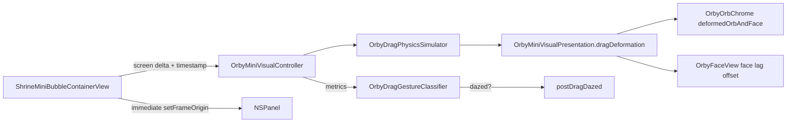

# Orby — Drag deformation physics (visual only)

**Parent:** [Orby.md](Orby.md) · **Related:** [Orby_DRAG_DAZED.md](Orby_DRAG_DAZED.md), [Orby_VISUAL_POLISH.md](Orby_VISUAL_POLISH.md)

## Core principle

| Layer | Behavior |
|-------|----------|
| **NSPanel / window** | Follows pointer **immediately** — no inertia, no spring, no delay |
| **Saved position** | Real panel origin on `mouseUp` only |
| **Hit testing** | Stable circle (`OrbyOrbGeometry`) — **does not** deform |
| **Orb shell + face** | Elastic squash/stretch + face lag — **visual only**, in memory |

Orby should feel like a small soft rubber orb when pulled, not like a jelly window.

## What we do **not** do

- Physics engine / mesh deformation
- Inertial window movement after release
- Throwing the panel
- Triggering dazed from deformation intensity (classifier only)
- Persisting velocity, deformation, or samples

## Architecture



## Files

| File | Role |
|------|------|
| `OrbyDragPhysics.swift` | Constants, math, `OrbyDragPhysicsSimulator` |
| `OrbyDragDeformationModifier.swift` | Vector-aligned rotate → scale → rotate back |
| `ShrineMiniVisualController.swift` | `beginDrag` / `noteDragStep` / `endDrag` / per-frame `advanceFrame` |
| `ShrineMiniOrbChrome.swift` | Deformation on orb shell; partial inherit on face |
| `OrbyOrbGeometry.swift` | `chromePadding` includes `visualBleedPadding` (anti-clip) |
| `ShrineMiniBubbleContainerView.swift` | Passes `NSEvent.timestamp` into physics |
| `OrbyDragGestureClassifier.swift` | Dazed decision (unchanged contract) |

## Physics model

### Inputs (per drag sample)

- Screen-space pointer delta (from container)
- Sample time (`NSEvent.timestamp`)
- Derived: `dt`, instant velocity, instant acceleration

### Smoothing

- `smoothedVelocity = lerp(smoothed, instant, 0.35)`
- `smoothedAcceleration = lerp(smoothed, instant, 0.20)`

Screen velocity is converted to **view-aligned** velocity (`y` flipped) so stretch axis matches on-screen drag direction.

### Intensity

| Constant | Value |
|----------|--------|
| `velocityDeadZone` | 40 pt/s |
| `deformationSoftStartSpeed` | 180 pt/s |
| `deformationMaxVisualSpeed` | 1250 pt/s |

```
dragIntensity = clamp((speed - softStart) / (maxVisual - softStart), 0, 1)
deformationIntensity = easeOutCubic(dragIntensity)   // 1 - (1-x)³
```

Slow drags → almost no deformation. Fast drags → stronger, clamped response.

### Squash / stretch targets

```
stretchTarget   = 1 + 0.09 * deformationIntensity  (+ accel boost up to +0.03)
compressionTarget = 1 - 0.065 * deformationIntensity  (- accel boost up to -0.025)
```

**Absolute caps:** stretch ≤ **1.14**, compression ≥ **0.88**

Acceleration boost when `|accel| > 2400` pt/s² (ramps to max at 10000).

### Deformation angle

**Vector-aligned** (preferred): `atan2(smoothedVelocity.dy, smoothedVelocity.dx)` in view space; applied via `OrbyDragDeformationModifier`.

### Face lag

Spring-damper toward `-dragDirection * maxFaceLag * deformationIntensity` (`maxFaceLag = 8.5` pt).

- Stiffness **70**, damping **12** while dragging
- Separate from legacy lerp-on-delta (removed)

Face inherits **36%** of orb stretch/compression for readability.

### Spring integration

Stretch, compression, and face lag use damped springs (not raw velocity → scale).

While dragging: chase deformation targets quickly (`stiffness ≈ 220`, `damping ≈ 26`).

On release:

| Release | Stiffness | Damping | Feel |
|---------|-----------|---------|------|
| Normal | 185 | 18 | Quick but visible rubber settle |
| Dazed | 128 | 13 | Longer wobble into stars |

## Layering (no clip)

- **Deforms:** `orbShell` + face (partial)
- **Does not deform:** ground shadow, Zzz, dazed halo (front/back), particles, hit target
- **Padding:** `OrbyOrbGeometry.chromePadding` = 14 + 6 bleed so 1.10 stretch and Zzz stay inside panel

Zzz remains upright in screen space (sibling of deformed group).

## Release flow

1. `dragTracker.finish()` → metrics  
2. `OrbyDragGestureClassifier.classify(metrics)` — **only** dazed trigger  
3. `positionStore.save(panel.origin)`  
4. `dragPhysics.release(dazed:)` — spring targets → rest  
5. Phase → `postDragDazed` or `awake` / `hoverExcited`  
6. Tick continues `advanceFrame` until settled → simulator idle  

## Drag expression (existing)

Phase `.dragging`: surprised-safe eyes, small “o” mouth, reduced tracking — unchanged in `OrbyEmotionCompositor`.

## Related systems (already shipped)

| Feature | Doc |
|---------|-----|
| Post-drag dazed classifier | [Orby_DRAG_DAZED.md](Orby_DRAG_DAZED.md) |
| Idle microbehaviors | [Orby_IDLE_MICROBEHAVIOR.md](Orby_IDLE_MICROBEHAVIOR.md) |
| Wake mouth / yawn | [Orby_VISUAL_POLISH.md](Orby_VISUAL_POLISH.md) |
| Emotion matrix | [Orby_EMOTION_MATRIX.md](Orby_EMOTION_MATRIX.md) |

## Tests

`NoxTests/Mac/OrbyDragPhysicsTests.swift` — intensity curve, clamps, angles, face lag clamp, slow-drag integration.

## Manual QA

1. Slow drag → panel immediate, orb nearly round.  
2. Moderate drag → subtle directional squash, slight face lag.  
3. Fast horizontal / vertical / diagonal → stretch aligns with drag vector.  
4. Normal release → quick return to circle, no dizzy unless classifier says so.  
5. Throw / shake (classifier) → stronger wobble, optional dazed stars.  
6. Hit test, context menu, click, saved position unchanged.  
7. Asleep Zzz not clipped at panel edge.

## Known limitations

- Deformation is uniform scale in a rotated frame, not true elastic mesh.  
- Very low frame rate during drag may reduce peak velocity estimates.  
- Face inherits partial deformation; extreme stretch still prioritizes readable eyes.
